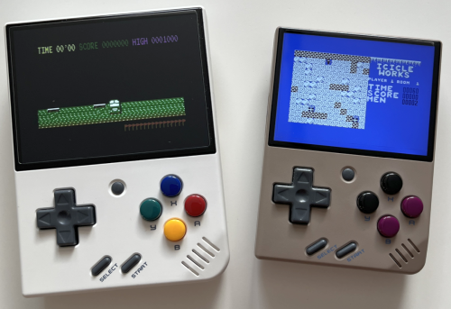

# MiyooMini_Plus4

The vice_xplus4_libretro.so core and settings for the MiyooMini and MiyooMini+

The [VICE Libretro core](https://docs.libretro.com/library/vice/) compiled with a modified [Onion make file](https://onionui.github.io/docs/dev/setup) for the Miyoo Mini, so you can play Commodore 16 and Commodore Plus 4 games on your Arm32 Miyoo handheld. 

## Installation

Whit the additional RetroArch and App settings, all you have to do is copy the project contents onto your SD card and install the core from the package manager.

Once done, you can place your "ROMs" (d64, zip, 7z, t64, crt, prg, nib, tap files) into the CPLUSFOUR ROM directory and start them from your games.

## Known issues

Since I'm not a developer, all I did was butchering the Onion dev env and [The Miyoo Mini toolchain](https://github.com/shauninman/union-miyoomini-toolchain) to make them compile the core, as is. 

Save states doesn't really work (neither on my officially supported handhelds, but still, I'm grateful for the devs, just saying to temper your expectations)

The loading times can be a bit long in our modern ages (you can fast forward as usual).
